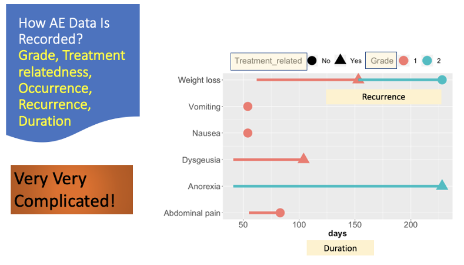
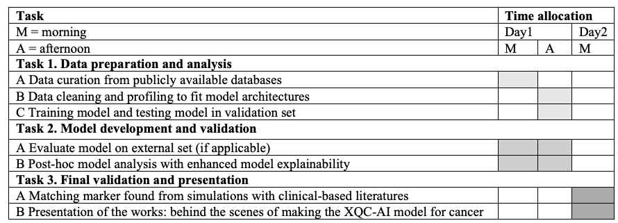

# Hackathon Projects 2022

## Klart Lists Accessible Research Tools (KLART)

### Project Lead: [Anders Berglund](mailto:anders.berglund@moffitt.org)

We are in our daily work, as a bioinformatician, biostatistician or as scientists in general, relying on other researchers tools and databases, i.e. “standing on the shoulders of giants”. We use these tools to simplify our work, but also to make sure that we do the best and correct analysis. One of the challenges is the vast number of new tools published every year with only a few surviving the test of time. A first pass to find out if a new tool is useful and reliable takes about a day and requires testing it with real data.

With this in mind, we propose to use “crowd-sourcing” to evaluate several tools in this project. Each team member will evaluate one tool using their expertise. This would include everything from databases, programming packages to online tools, requiring little to no experience in programming. The results will be summarized in a single slide for each tool and in a summary table for the whole project. In order to focus on newer, less established, tools, we suggest only evaluating tools from 2020 or later.
Example of sources for finding new tools include, but are not limited to Nucleic Acid Research ([NAR](https://academic.oup.com/nar)) yearly [Database issue](https://academic.oup.com/nar/issue/50/D1) and Web Server issue. The journal [Bioinformatics](https://academic.oup.com/nar/issue/50/w1) and its [Application notes](https://academic.oup.com/bioinformatics/issue/38/21?browseBy=volume#1485392-6696205). There are also other list available, such as: [List of bioinformatics software](https://en.wikipedia.org/wiki/List_of_bioinformatics_software) but the challenge is that they tend to become stale and do not necessary fits the type of tools that we are interested in.
 
**Impact**: The project will generate a list of potentially useful tools that have been evaluated by a Moffitt team member. Useful tool will thus be promoted and shared across scientists at Moffitt.
 
**Technical Specifications**: None.
 
**Programming background**: None.

## 

## State-of-art statistical analysis of adverse event data to predict clinical outcomes in clinical trial 

### Project Lead: [Dung-Tsa Chen](mailto:Dung-Tsa.Chen@moffitt.org) and [Zachary Thompson](Zachary.Thompson@moffitt.org)

**Background**: Adverse event (AE) is a critical element in clinical trial to evaluate patient safety profile of the drug for benefit-risk assessment. AE is also shown to have clinical association. However, due to its complexity, utilization of AE data has been suboptimal. We have developed a unique approach to utilize AE parameters and to derive a set of innovative AE metrics. Application to two interim cohorts from two ongoing trials has demonstrated the AE potential as a predictive biomarker of treatment response and survival outcomes. 

***Lethal beauty of AE Data***: 

 
***Challenging task***: In this hackathon, we would like to borrow your talent to help build statistical analysis framework to automatically generate informative AE report, including survival plot and boxplot for each AE marker, summary plots of effect size and p value, summary tables for significant AEs, network analysis of significant AEs, pubmed analysis of significant AEs, and a key summary text to highlight significant AEs. Our goal is to build up a pipeline from data analysis to professional report. 
 
**Technical specifications**: basic R, statistical and/or machine learning approaches for AE marker development

**Programming background**: R and R markdown/Shiny

## Statement of Work (SOW) reports

### Project Lead: [Guillermo Gonzalez-Calderon](mailto:Guillermo.Gonzalez-Calderon@moffitt.org)

A Statement of Work is used to describe a project’s work requirements, defining specific activities, deliverables and timelines. It includes an estimated number of hours to complete the project, and the corresponding price to be charged for the services; a SOW is an agreement between the Investigator and the Core for working on a specific project.
Often the estimated times differ from the real times, and projects take longer to complete. This causes frustration, problems with billing and deadlines, etc.

**Impact**: Having a tool that can provide reports to compare estimated times and costs (SOWs) vs real data (LIMS) in projects, compare charged vs non-charged activities, and having alerts when approaching the estimated number of hours for a project, could help a lot in the planning and management of both new and existing projects at Moffitt, involving several Cores and Shared Resources.

**Technical specifications**: Project Planning, Relational Databases, System Integration, Web development

**Programming background**: 
Familiarity with web development, either backend or frontend.  

**Number of participants**: 1-4

## The eXplainable Quantum-Classical AI-based (XQC-AI) tool for clinical decision support

### Project Lead: [Nam Nguyen](mailto:Nam.Nguyen@Moffitt.org)

**Concept and potential applications**: We propose a highly eXplainable Quantum-Classical AI-based tool for the patient-specific biomarker identification and interaction network analysis. With this approach we aim to move toward more general AI for diagnosis tasks supporting clinical decisions. More general AI offers opportunity for machines not only to learn to produce data-driven inference but also teach by revealing intrinsic disease pattern through neural signals. Using machine intelligence for a better understanding of disease progression, we will focus on colorectal cancer with metastasis to liver. 

**Background**: Our vision is to generate the diagnostic tool that can serve precision medicine and oncology for the next several decades. From our perspective, humans have capability to construct an Artificial Intelligence (AI)-based system to find the cure for any disease by decomposition into the indecomposable fiber of nature. The definition of indecomposable factors relative to a field of study can be biologically interpreted as genetic factors. In this project, the examples of such genetic factors include well-known onco-related drivers such as TP53 or Ras-related family. We propose that with the XQC-AI, more complete understanding of the causality relationship of genetic alterations from the first stage of disease through the multi-stage of disease progression can be achieved and, as a result, this knowledge can better support clinicians’ decisions. 
 
**Approach**: Given that the human genome has ~20,000 genes, there are $2^{20,000}=4\times 10^{6020}$$ candidate biomarkers for one pathway of interest. Given a full set of quantified genes $\mathcal{G}=\{G_1, \dots, G_k\}$ with associated molecular features set $\mathcal{X}=\{X_1, \dots, X_k\}$ such as mRNA, RNA expression, or DNA methylation. We aim to find a subset of genes whose feature set $\mathbb{S}=\{ X_i \}_{i=1}^k$ for $k \leq m$ . The number of all possible combinations for biomarker sets (including ∅) is given by 

$$2^{m}=\sum_{i=0}^{m}{m \choose i}$$

We will use the quantum feature map representations to sample the most putative drivers for uni- and multi-targeted pathways of interest. We will use a quantum neural network as a probabilistic sampler to score genes based on Mutual Information-based criteria. Quantum Computing (QC) provides continuous computational platforms and can accelerate (exponentially) some of the intrinsically difficult problems for classical computers. We also hope to overcome the black-box property (unknown and intractable) of current AI by claiming that machines must not only learn from data but also teach by explaining their neural signals to humans. 

**Summary**: At the end of this project, we hope to propose a new way for network analysis in cancer genomics, including analysis based on molecular features (XQC-AI) and clinical literature mining. This extended effort will help elucidate importance of the AI-driven biomarkers in established clinical trials; thus, translating AI inference to potential new targets in oncology. 

**Technical specifications**:

* Quantum Computing:
   * IBM-Q: https://quantum-computing.ibm.com/
   * Qiskit: https://qiskit.org/
   * Strawberry Field: https://strawberryfields.ai/
   * Pennylane: https://pennylane.ai/
* Classical Deep Learning:
   * PyTorch: https://pytorch.org/
   * Tensorflow: https://www.tensorflow.org/
   * Deep-Survival: https://github.com/jaredleekatzman/* DeepSurv
* Classical ML and Statistical Analysis
   * https://scikit-learn.org/stable/
* Natural Language Processing
   * Compound-Cancer-Knowledge Base https://knowledgebase.microdiscovery.de/heatmap
   * Text mined biomarkers in cancer for curation into the CIViC database. http://bionlp.bcgsc.ca/civicmine/

**Programming background**: Python, R.

## Generating, visualizing, and quantitatively analyzing graphs of multi-omics data

### Project Lead: [Ghulam Rasool](Ghulam.Rasool@moffitt.org)

This project will aim to build graphs from various omics datasets and then quantitatively analyze their relationships with each other to unravel the underlying biological phenomena (such as cancer) captured by multiple omics data. After building initial graphs (i.e., adjacency matrices) and estimating their features for each dataset, we will use Graph Neural Networks to finetune the structure and features of these graphs for the specified outcome, e.g., survival. The project will also involve building visualization at each stage of data processing. The team will share pre-processed and curated datasets, machine learning models, and basic visualization codes.

**Technical Specifications**: Familiarity with the PyTorch framework, graphical neural networks, or high-dimensional omics data

**Programming background**: Python

## A web-based visualization tool for proteomics and metabolomics data

### Project Lead: [Inna Smalley](mailto:Inna.Smalley@moffitt.org)

Project title: Interactive omics data visualization and analytics tool for non-programmers
 
**Brief background and summary of project**: Typically, the analysis and visualization of proteomics and metabolomics datasets by basic and clinical science investigators requires the knowledge of programming language or the utilization of the BBSR core facility. Most basic and clinical science investigators do not have programming experience and often times even the most basic data processing is quite expensive and therefore inaccessible to the investigators. In order to make omics data analysis more accessible for Moffitt investigators,  it would be incredibly valuable for Moffitt to have a web-based analysis and visualization tool for proteomics and metabolomics data that can be used by investigators without programming experience. The Proteomics and Metabolomics core facility delivers output data in a standardized way and in BBSR we already have a fairly standardized pipeline for the QC and analysis of proteomics and metabolomics datasets. The goal of this project would be to package these workflows into something Moffitt investigators without programing experience could use. The idea is to create a platform where they would upload the Proteomics/Metabolomics output file into the analytics tool and have the data QC’d and visualized based on some basic comparison selections. The tool would also provide a spreadsheet output with normalized data, including log normalization and statistical analysis based on comparison selections. This would then allow the investigators to determine if the experiment was successful and to get preliminary insights into the data in order to determine if further analysis would be worth pursuing. This tool would also allow for rapid data processing and visualization, enabling the investigators to quickly obtain preliminary data for grant applications.
 
**Technical specifications**: It may be helpful if people are familiar with Proteomic/metabolomic datasets and the typical BBSR pipeline for processing these datasets. Anyone who is familiar with the current VEMO or ISCVA tools. I would be happy to provide example datasets for this project, we have many we could use for development and proof of principle demonstration.  
 
**Programming background**: R/Shiny. Happy to take on anyone who is interested in working on this project, regardless of previous expertise